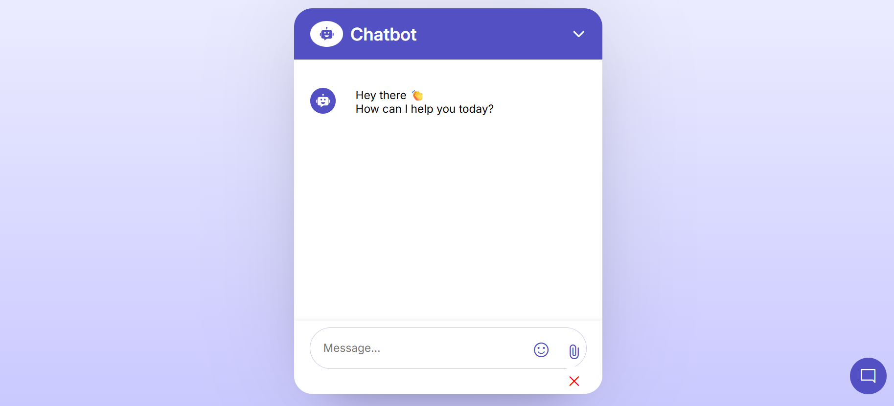
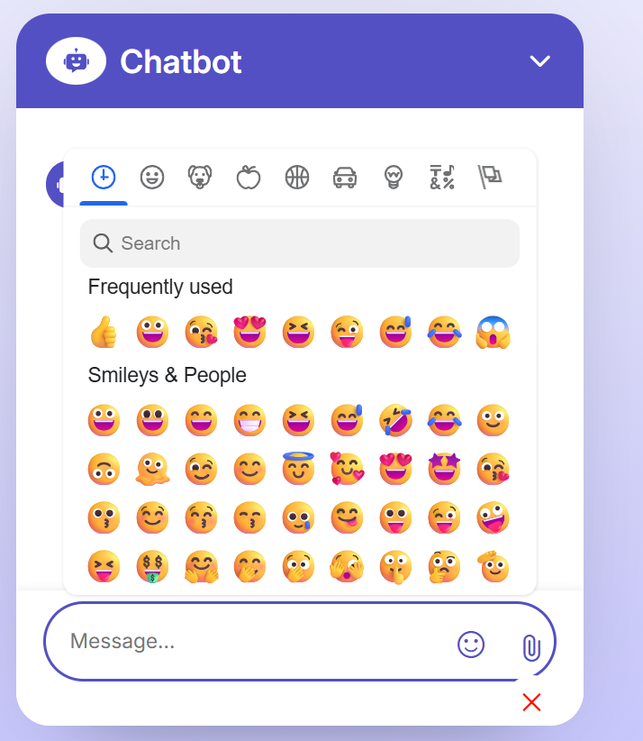
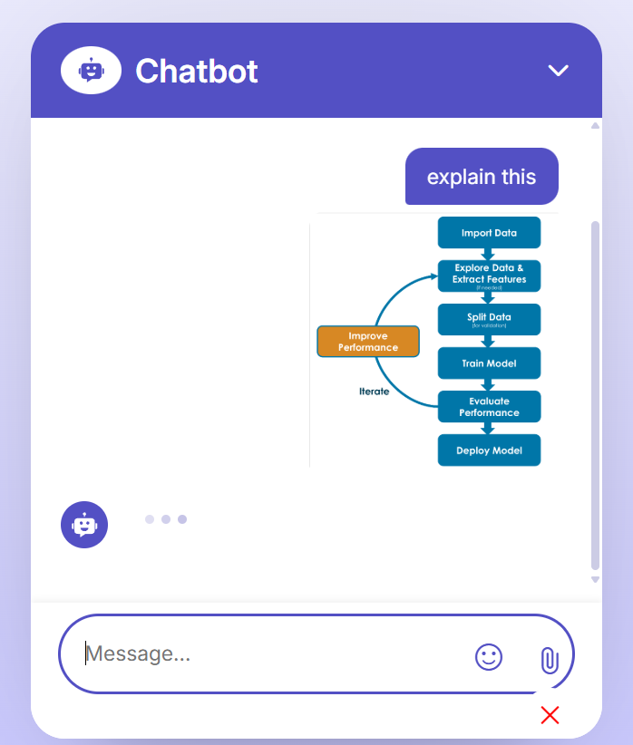

# 🤖 AI Chatbot with Gemini API

A responsive and interactive AI chatbot web application powered by **Google Gemini API**. This project combines modern HTML, CSS, and JavaScript to simulate real-time chat conversations with an AI, supporting features like emoji picker, file upload, chat history, and a chatbot popup.

## 🌐 Live Website: [AI Chatbot](https://aichatbot-liart-ten.vercel.app/)

## 🎬 Sample Video: [Video](https://drive.google.com/file/d/1cIiCMZzYux8HUHzfiNzVZ0Sjqnp1ddGT/view?usp=sharing)

## 📸 Screenshots

| Chat Interface | Emoji Picker | File Upload |
|----------------|--------------|-------------|
|  |  |  |

---

## 🚀 Features

- 💬 Real-time AI Responses via **Gemini API**
- ✨ Beautiful Chat UI with responsive design
- ⏳ Loading animation while waiting for AI
- 📁 File Upload Support
- 😄 Emoji Picker Integration
- 🧠 Chat History Retention
- 🪄 Popup Chatbot Toggle

---

## 🛠️ Tech Stack

- **Frontend**: HTML, CSS, JavaScript
- **AI API**: Google Gemini API (via API key)

---

## 🔧 Setup Instructions

1. **Clone the Repository**

   ```bash
   git clone https://github.com/neelanshu7/AI-Chatbot.git
   cd AI-Chatbot

2. **Replace Gemini API Key**

   ```bash
   const API_KEY = "your_gemini_api_key_here";

3. **Run the Web App**<br>
   Simply open index.html in your browser.

## 🧪 Project Structure
   ```bash
AI-Chatbot/
│
├── index.html          # Main UI
├── style.css           # Styling file
├── script.js           # Core JavaScript logic
└── screenshots/        # UI Screenshots (for README)
   ```

## 🔗 Important Links
   🧠 Text Generation API (Gemini): https://ai.google.dev/gemini-api/docs/text-generation<br>
   🔐 Get your Gemini API Key: https://ai.google.dev/gemini-api/docs<br>
   🎨 Browse Google Fonts: https://fonts.google.com/<br>

